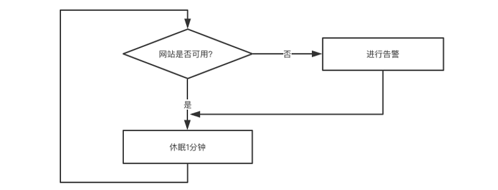
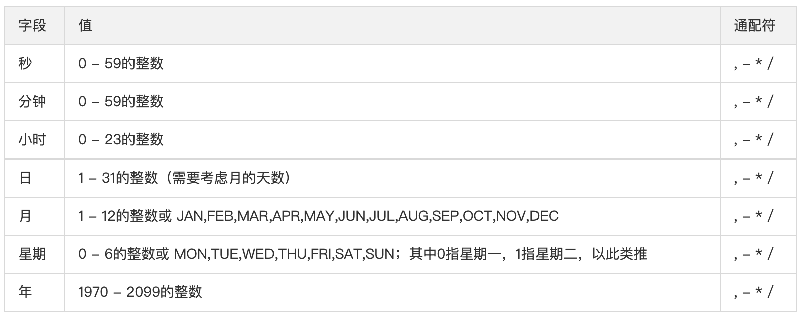
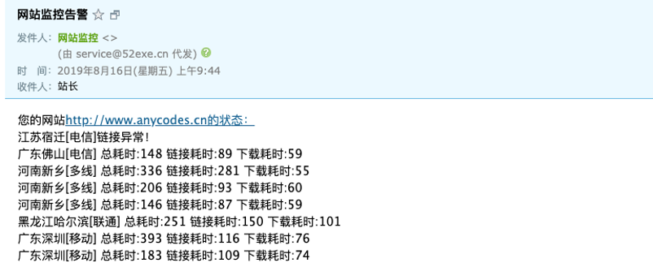
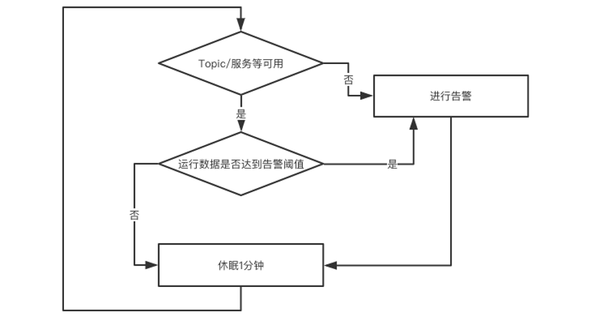

# 第一篇：通过Serverless架构实现监控告警能力

## 前言

在实际生产中，我们经常需要做一些监控脚本监控我们的网站服务或者API服务是否可用。传统的方法是通过一些网站监控平台（例如DNSPod监控、360网站服务监控，以及阿里云监控等），这些监控平台的原理是通过用户自己设置要监控的服务地址和监测的时间阈值，由监控平台定期发起请求对网站或服务的可用性进行判断。当然，这些服务很多都是大众化的，通用性很强，但是并不一定适合我们，例如说，我现在需要做这样一个监控程序，我要监控我的网站状态码，不同区域的延时，并且通过监控得到的数据，设定一个阈值，超过这个阈值，会通过邮件等进行统治告警，针对这样一个定制化需求，可能大部分的监控平台就很难完成我们的需求，由此定制开发一个网站状态监控工具就显得尤为重要。

Serverless服务的一个很重要的应用场景就是运维、监控与告警，所以本实验将会通过现有的Serverless平台，部署一个网站状态监控脚本，对目标网站的可用性进行一个监控告警。


## Web服务监控告警

针对Web服务，我们先设计一个简单的监控告警功能的流程：



在这个流程中，我们仅对网站的状态码进行监控，即返回的状态为200，则判定网站可正常使用，否则进行告警:

```python
# -*- coding: utf8 -*-
import ssl
import json
import smtplib
import urllib.request
from email.mime.text import MIMEText
from email.header import Header

ssl._create_default_https_context = ssl._create_unverified_context


def sendEmail(content, to_user):
    sender = 'service@anycodes.cn'
    receivers = [to_user]

    mail_msg = content
    message = MIMEText(mail_msg, 'html', 'utf-8')
    message['From'] = Header("网站监控", 'utf-8')
    message['To'] = Header("站长", 'utf-8')

    subject = "网站监控告警"
    message['Subject'] = Header(subject, 'utf-8')

    try:
        smtpObj = smtplib.SMTP_SSL("smtp.exmail.qq.com", 465)
        smtpObj.login('发送邮件的邮箱地址', '密码')
        smtpObj.sendmail(sender, receivers, message.as_string())
    except smtplib.SMTPException as e:
        print(e)


def getStatusCode(url):
    return urllib.request.urlopen(url).getcode()


def main_handler(event, context):
    url = "http://www.anycodes.cn"
    if getStatusCode(url) == 200:
        print("您的网站%s可以访问！" % (url))
    else:
        sendEmail("您的网站%s 不可以访问！" % (url), "接受人邮箱地址")
    return None
```

通过ServerlessFramework可以部署，在部署的时候可以增加时间触发器：

```yaml
MyWebMonitor:
  component: "@serverless/tencent-scf"
  inputs:
    name: MyWebMonitor
    codeUri: ./code
    handler: index.main_handler
    runtime: Python3.6
    region: ap-guangzhou
    description: 网站监控
    memorySize: 64
    timeout: 20
    events:
      - timer:
          name: timer
          parameters:
            cronExpression: '*/5 * * * *'
            enable: true
```

在这里，timer表示时间触发器，`cronExpression`是表达式：

> 创建定时触发器时，用户能够使用标准的 Cron 表达式的形式自定义何时触发。定时触发器现已推出秒级触发功能，为了兼容老的定时触发器，因此 Cron 表达式有两种写法。
> #### Cron 表达式语法一（推荐）
> Cron 表达式有七个必需字段，按空格分隔。
> 
> 其中，每个字段都有相应的取值范围：
> 
> #### Cron 表达式语法二（不推荐）
> Cron 表达式有五个必需字段，按空格分隔。
> 
> 其中，每个字段都有相应的取值范围：
> 
> #### 通配符
> 
> #### 注意事项
> 在 Cron 表达式中的“日”和“星期”字段同时指定值时，两者为“或”关系，即两者的条件分别均生效。
> #### 示例
> `*/5 * * * * * *` 表示每5秒触发一次   
> `0 0 2 1 * * *` 表示在每月的1日的凌晨2点触发   
> `0 15 10 * * MON-FRI *` 表示在周一到周五每天上午10：15触发   
> `0 0 10,14,16 * * * *` 表示在每天上午10点，下午2点，4点触发   
> `0 */30 9-17 * * * *` 表示在每天上午9点到下午5点内每半小时触发   
> `0 0 12 * * WED *` 表示在每个星期三中午12点触发

所以可以认为我们上面的代码是每5秒触发一次，当然，我们还可以设置没分钟，每小时触发，这就看我们对我们网站监控的密度是多少了。当我们网站服务不可用时，可以收到告警：


这种网站监控方法是比较简单的，当然也可能会不准。我们经常对网站或者服务进行监控并不是简简单单的看其能不能返回200的状态码，还要看链接耗时、下载耗时以及不同区域、不同运营商访问我们的网站或者服务的延时信息等。所以，我们需要对这个代码进行额外的更新与优化：
1.	通过在线网速测试的网站，抓包获取不通地区不同运营商的请求特征；
2.	编写爬虫程序，进行在线网速测试模块的编写；
3.	集成到刚刚的项目中；
	我们这里以站长工具网站中国内网站测速工具 为例，可以通过网页查到相关信息：
所以我们可以对依稀网站测速工具进行封装，例如：


通过对网页进行分析，获取请求特征，包括Url，Form data，以及Headers等相关信息，其中该网站在使用不同监测点对网站进行请求时，是通过Form data中的guid的参数实现的，例如部分监测点的guid：

```text
广东佛山	电信	f403cdf2-27f8-4ccd-8f22-6f5a28a01309
江苏宿迁	多线	74cb6a5c-b044-49d0-abee-bf42beb6ae05
江苏常州	移动	5074fb13-4ab9-4f0a-87d9-f8ae51cb81c5
浙江嘉兴	联通	ddfeba9f-a432-4b9a-b0a9-ef76e9499558
```

此时，我们可以编写基本的爬虫代码，来对Response进行初步解析，以`62a55a0e-387e-4d87-bf69-5e0c9dd6b983 江苏宿迁[电信]`为例，编写代码：

```python
import urllib.request
import urllib.parse

url = "*某测速网站地址*"
form_data = {
    'guid': '62a55a0e-387e-4d87-bf69-5e0c9dd6b983',
    'host': 'anycodes.cn',
    'ishost': '1',
    'encode': 'ECvBP9vjbuXRi0CVhnXAbufDNPDryYzO',
    'checktype': '1',
}
headers = {
    'Host': 'tool.chinaz.com',
    'Origin': '*某测速网站地址*',
    'Referer': '*某测速网站地址*',
    'User-Agent': 'Mozilla/5.0 (Macintosh; Intel Mac OS X 10_14_3) AppleWebKit/537.36 (KHTML, like Gecko) Chrome/74.0.3729.108 Safari/537.36',
    'X-Requested-With': 'XMLHttpRequest'
}

print(urllib.request.urlopen(
    urllib.request.Request(
        url=url,
        data=urllib.parse.urlencode(form_data).encode('utf-8'),
        headers=headers
    )
).read().decode("utf-8"))

```

获得结果：

```json
({
	state: 1,
	msg: '',
	result: {
		ip: '119.28.190.46',
		httpstate: 200,
		alltime: '212',
		dnstime: '18',
		conntime: '116',
		downtime: '78',
		filesize: '-',
		downspeed: '4.72',
		ipaddress: '新加坡新加坡',
		headers: 'HTTP/1.1 200 OK br>Server: ...',
		pagehtml: ''
	}
})

```

在这个结果中，我们可以提取部分数据，例如江苏宿迁\[电信\]访问目标网站的基础数据：

```text
总耗时：alltime:'212'
链接耗时：conntime:'116'
下载耗时：downtime:'78'

```

此时，我们可以改造代码对更多的节点，进行测试：

```text
江苏宿迁[电信]	总耗时:223	链接耗时:121	下载耗时:81
广东佛山[电信]	总耗时:44	链接耗时:27	下载耗时:17
广东惠州[电信]	总耗时:56	链接耗时:34	下载耗时:22
广东深圳[电信]	总耗时:149	链接耗时:36	下载耗时:25
浙江湖州[电信]	总耗时:3190	链接耗时:3115	下载耗时:75
辽宁大连[电信]	总耗时:468	链接耗时:255	下载耗时:170
江苏泰州[电信]	总耗时:180	链接耗时:104	下载耗时:69
安徽合肥[电信]	总耗时:196	链接耗时:110	下载耗时:73
...

```

并对项目中的index.py进行代码修改：

```python
# -*- coding: utf8 -*-
import ssl
import json
import re
import socket
import smtplib
import urllib.request
from email.mime.text import MIMEText
from email.header import Header

socket.setdefaulttimeout(2.5)
ssl._create_default_https_context = ssl._create_unverified_context

def getWebTime():

    final_list = []
    final_status = True

    total_list = '''62a55a0e-387e-4d87-bf69-5e0c9dd6b983 江苏宿迁[电信]
    f403cdf2-27f8-4ccd-8f22-6f5a28a01309 广东佛山[电信]
    5bea1430-f7c2-4146-88f4-17a7dc73a953 河南新乡[多线]
    1f430ff0-eae9-413a-af2a-1c2a8986cff0 河南新乡[多线]
    ea551b59-2609-4ab4-89bc-14b2080f501a 河南新乡[多线]
    2805fa9f-05ea-46bc-8ac0-1769b782bf52 黑龙江哈尔滨[联通]
    722e28ca-dd02-4ccd-a134-f9d4218505a5 广东深圳[移动]
8e7a403c-d998-4efa-b3d1-b67c0dfabc41 广东深圳[移动]'''

    url = "*某测速网站地址*"
    for eve in total_list.split('\n'):
        id_data, node_name = eve.strip().split(" ")
        form_data = {
            'guid': id_data,
            'host': 'anycodes.cn',
            'ishost': '1',
            'encode': 'ECvBP9vjbuXRi0CVhnXAbufDNPDryYzO',
            'checktype': '1',
        }
        headers = {
            'Host': '*某测速网站地址*',
            'Origin': '*某测速网站地址*',
            'Referer': '*某测速网站地址*',
            'User-Agent': 'Mozilla/5.0 (Macintosh; Intel Mac OS X 10_14_3) AppleWebKit/537.36 (KHTML, like Gecko) Chrome/74.0.3729.108 Safari/537.36',
            'X-Requested-With': 'XMLHttpRequest'
        }
        try:
            result_data = urllib.request.urlopen(
                urllib.request.Request(
                    url=url,
                    data=urllib.parse.urlencode(form_data).encode('utf-8'),
                    headers=headers
                )
            ).read().decode("utf-8")
            try:
                alltime = re.findall("alltime:'(.*?)'", result_data)[0]
                conntime = re.findall("conntime:'(.*?)'", result_data)[0]
                downtime = re.findall("downtime:'(.*?)'", result_data)[0]
                final_string = "%s\t总耗时:%s\t链接耗时:%s\t下载耗时:%s" % (node_name, alltime, conntime, downtime)
            except:
                final_string = "%s链接异常！" % (node_name)
                final_status = False
        except:
            final_string = "%s链接超时！" % (node_name)
            final_status = False
        final_list.append(final_string)
        print(final_string)
    return (final_status,final_list)
def sendEmail(content, to_user):
    sender = 'service@anycodes.cn'
    receivers = [to_user]
    mail_msg = content
    message = MIMEText(mail_msg, 'html', 'utf-8')
    message['From'] = Header("网站监控", 'utf-8')
    message['To'] = Header("站长", 'utf-8')
    subject = "网站监控告警"
    message['Subject'] = Header(subject, 'utf-8')
    try:
        smtpObj = smtplib.SMTP_SSL("smtp.exmail.qq.com", 465)
        smtpObj.login('service@anycodes.cn', '密码')
        smtpObj.sendmail(sender, receivers, message.as_string())
    except smtplib.SMTPException:
        pass

def getStatusCode(url):
    return urllib.request.urlopen(url).getcode()

def main_handler(event, context):
    url = "http://www.anycodes.cn"
    final_status,final_list = getWebTime()
    if not final_status:
        sendEmail("您的网站%s的状态：<br>%s" % (url, "<br>".join(final_list)), "service@52exe.cn")

```

由于，是学习为主，所以这里我已经将节点列表进行了缩减，只留了几个。通过部署，可得到结果：



当然，告警的灵敏度和监控的频率，在实际生产过程中可以根据自己的需求进行调整。

## 云服务监控告警

上一部分，我们对网站状态以及健康等信息进行了监控与告警，在实际的生产运维中，还非常有必要对所使用的服务进行监控，例如在使用Hadoop、Spark的时候要对节点的健康进行监控，在使用K8S的时候要对API网关、ETCD等多维度的指标进行监控，在使用Kafka的时候，也要对数据积压量，以及Topic、Consumer等进行监控；这些服务的监控，往往不能通过简单的URL以及某些状态来进行判断，在传统的运维中，通常会在额外的机器上设置一个定时任务，对相关的服务进行旁路监控。本章则会通过Serverless技术，对云产品进行相关的监控与告警。

在使用云上的Kafka时，我们通常要看数据积压量，因为我们的Consumer集群如果挂掉了，或者消费能力突然降低导致数据积压，很可能会对我们的服务产生不可预估的影响，这个时候对Kafka的数据积压量进行监控告警，就显得额外重要。本文以监控腾讯云的Ckafka为例进行实践，并将会通过多个云产品进行组合（包括云监控，Ckafka，云API以及云短信等）来实现一个短信告警、邮件告警以及企业微信告警功能。

首先，可以设计简单的流程图：



在开始项目之前，我们要准备一些基础的模块：

* Kafka数据积压量获取模块：

```python
def GetSignature(param):
    # 公共参数
    param["SecretId"] = ""
    param["Timestamp"] = int(time.time())
    param["Nonce"] = random.randint(1, sys.maxsize)
    param["Region"] = "ap-guangzhou"
    # param["SignatureMethod"] = "HmacSHA256"
    # 生成待签名字符串
    sign_str = "GETckafka.api.qcloud.com/v2/index.php?"
    sign_str += "&".join("%s=%s" % (k, param[k]) for k in sorted(param))
    # 生成签名
    secret_key = ""
    if sys.version_info[0] > 2:
        sign_str = bytes(sign_str, "utf-8")
        secret_key = bytes(secret_key, "utf-8")
    hashed = hmac.new(secret_key, sign_str, hashlib.sha1)
    signature = binascii.b2a_base64(hashed.digest())[:-1]
    if sys.version_info[0] > 2:
        signature = signature.decode()
    # 签名串编码
    signature = urllib.parse.quote(signature)
    return signature

def GetGroupOffsets(max_lag, phoneList):
    param = {}
    param["Action"] = "GetGroupOffsets"
    param["instanceId"] = ""
    param["group"] = ""
    signature = GetSignature(param)
    # 生成请求地址
    param["Signature"] = signature
    url = "https://ckafka.api.qcloud.com/v2/index.php?Action=GetGroupOffsets&"
    url += "&".join("%s=%s" % (k, param[k]) for k in sorted(param))
    req_attr = urllib.request.urlopen(url)
    res_data = req_attr.read().decode("utf-8")
    json_data = json.loads(res_data)
    for eve_topic in json_data['data']['topicList']:
        temp_lag = 0
        result_list = []
        for eve_partition in eve_topic["partitions"]:
            lag = eve_partition["lag"]
            temp_lag = temp_lag + lag
        if temp_lag > max_lag:
            result_list.append(
                {
                    "topic": eve_topic["topic"],
                    "lag": lag
                }
            )
        print(result_list)
        if len(result_list)>0:
            KafkaLagRobot(result_list)
            KafkaLagSMS(result_list,phoneList)

```

* 接入企业微信机器人模块：

```python
def KafkaLagRobot(content):
    url = ""
    data = {
        "msgtype": "markdown",
        "markdown": {
            "content": content,
        }
    }
    data = json.dumps(data).encode("utf-8")
    req_attr = urllib.request.Request(url, data)
    resp_attr = urllib.request.urlopen(req_attr)
    return_msg = resp_attr.read().decode("utf-8")

```

* 接入腾讯云短信服务模块：

```python
def KafkaLagSMS(infor, phone_list):
    url = ""
    strMobile = phone_list
    strAppKey = ""
    strRand = str(random.randint(1, sys.maxsize))
    strTime = int(time.time())
    strSign = "appkey=%s&random=%s&time=%s&mobile=%s" % (strAppKey, strRand, strTime, ",".join(strMobile))
    sig = hashlib.sha256()
    sig.update(strSign.encode("utf-8"))

    phone_dict = []
    for eve_phone in phone_list:
        phone_dict.append(
            {
                "mobile": eve_phone,
                "nationcode": "86"
            }
        )
    data = {
        "ext": "",
        "extend": "",
        "params": [
            infor,
        ],
        "sig": sig.hexdigest(),
        "sign": "你的sign",
        "tel": phone_dict,
        "time": strTime,
        "tpl_id": 你的模板id
    }
    data = json.dumps(data).encode("utf-8")
    req_attr = urllib.request.Request(url=url, data=data)
    resp_attr = urllib.request.urlopen(req_attr)
    return_msg = resp_attr.read().decode("utf-8")

```

* 发送邮件告警模块：

```python
def sendEmail(content, to_user):
    sender = 'service@anycodes.cn'
    message = MIMEText(content, 'html', 'utf-8')
    message['From'] = Header("监控", 'utf-8')
    message['To'] = Header("站长", 'utf-8')
    message['Subject'] = Header("告警", 'utf-8')
    try:
        smtpObj = smtplib.SMTP_SSL("smtp.exmail.qq.com", 465)
        smtpObj.login('service@anycodes.cn', '密码')
        smtpObj.sendmail(sender, [to_user], message.as_string())
    except smtplib.SMTPException as e:
        logging.debug(e)

```

完成模块编写，和上面的方法一样，进行项目部署，部署成功，可以进行测试，测试可看到功能可用：

* 短信告警样式：


* 企业微信告警样式：


## 总结

通过该场景实践，希望读者可以了解到Serverless相关产品在运维行业中的基本应用，尤其是监控告警的基本使用方法和初步灵感。设计一个网站监控程序实际上是一个很初级的入门场景，同时也希望大家可以将更多的监控告警功与Serverless技术进行结合，例如监控自己的Mysql压力情况、监控自己已有服务器的数据指标等，通过这些指标的监控告警，不仅仅可以让管理者及时发现服务的潜在风险，也可以通过一些自动化流程实现项目的自动化运维。

通过本场景实践，我们也可以对项目进行额外的优化或者应用在不同的领域以及场景中。例如，我们可以通过增加短信告警、微信告警、企业微信告警等多个维度（后续的应用场景会举例说明），以确保相关人员可以及时收到告警信息；我们也可以通过监控某个小说网站、视频网站等时刻看到我们关注的小说或者视频的更新情况，便于我们追更等。

> 本章内容大部分资料来自图书《Serverless架构：从原理、设计到项目实战》