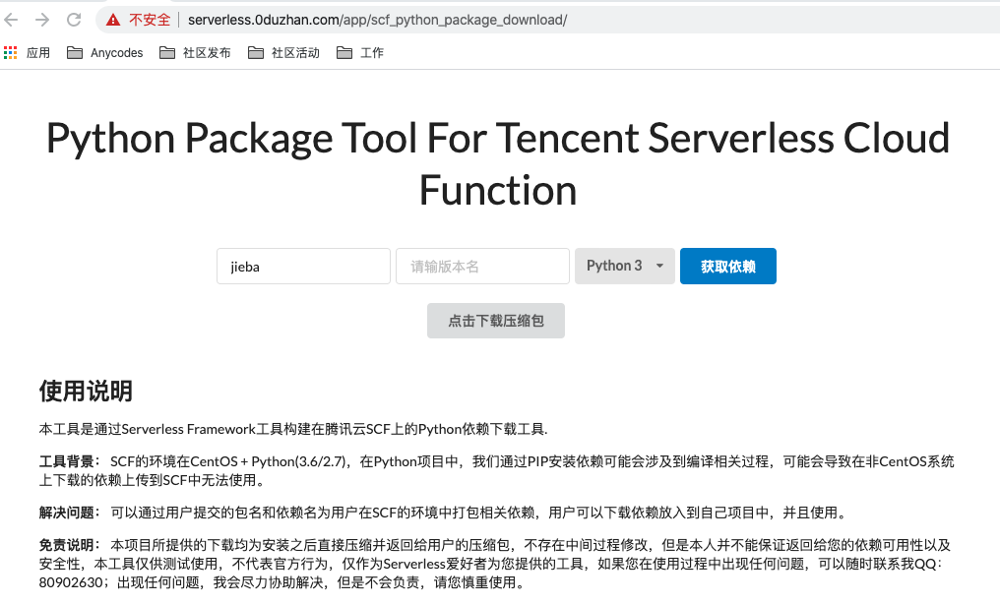
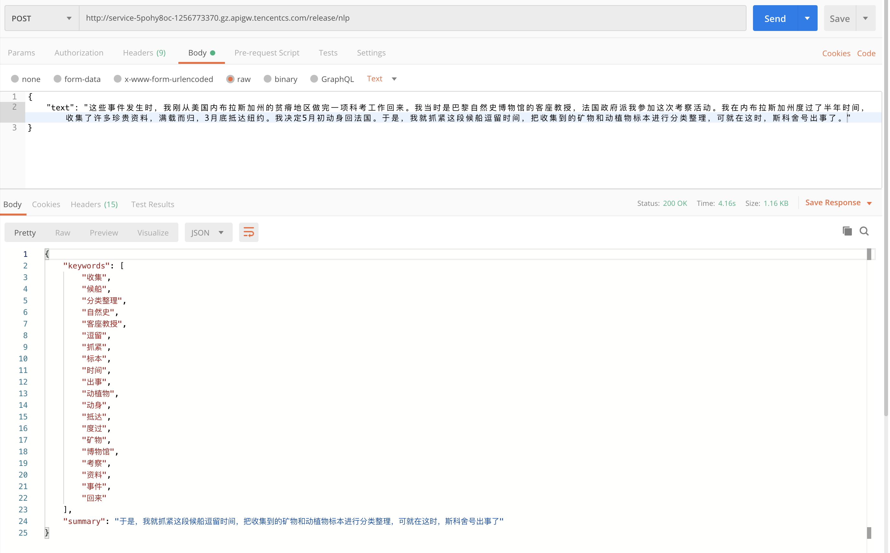

# 第三篇：Serverless与NLP实现文本摘要和关键词提取 

## 前言

对文本进行自动摘要的提取和关键词的提取，属于自然语言处理的范畴。提取摘要的一个好处是可以让阅读者通过最少的信息判断出这个文章对自己是否有意义或者价值，是否需要进行更加详细的阅读；提取关键词的好处是可以让文章与文章之间产生关联，同时也可以让读者通过关键词快速定位到和该关键词相关的文章内容；同时文本摘要和关键词提取又都可以和传统的CMS进行结合，通过对文章/新闻等发布功能进行改造，可以同步提取关键词和摘要，放到HTML页面中，作为Description和Keyworks，在一定程度上有利于搜索引擎收录，属于SEO优化的范畴。

## 关键词提取

关键词提取的方法很多，但是最常见的应该就是`tf-idf`了。

通过`jieba`实现基于`tf-idf`关键词提取的方法：

```python
jieba.analyse.extract_tags(text, topK=5, withWeight=False, allowPOS=('n', 'vn', 'v'))
```

## 文本摘要

文本摘要的方法有很多，就广义上来划分就包括了提取式和生成式。所谓提取式就是在文章中通过`TextRank`等算法，找出关键句然后进行拼装，形成摘要，这种方法相对来说比较简单，但是很难提取出真是的语义等；另一种方法是生成式，所谓生成式就是通过深度学习等方法，对文本语义进行提取再生成摘要。可以认为前者生成的摘要，所有句子来自原文，后者则是独立生成。

为了简化难度，本文将采用提取式来实现文本摘要功能，通过SnowNLP这个第三方库，实现基于`TextRank`的文本摘要功能，由于是第三方库，所以相对来说比较容易实现，以《海底两万里》部分内容作为原文，进行摘要生成：

原文：

> 这些事件发生时，我刚从美国内布拉斯加州的贫瘠地区做完一项科考工作回来。我当时是巴黎自然史博物馆的客座教授，法国政府派我参加这次考察活动。我在内布拉斯加州度过了半年时间，收集了许多珍贵资料，满载而归，3月底抵达纽约。我决定5月初动身回法国。于是，我就抓紧这段候船逗留时间，把收集到的矿物和动植物标本进行分类整理，可就在这时，斯科舍号出事了。
我对当时的街谈巷议自然了如指掌，再说了，我怎能听而不闻、无动于衷呢？我把美国和欧洲的各种报刊读了又读，但未能深入了解真相。神秘莫测，百思不得其解。我左思右想，摇摆于两个极端之间，始终形不成一种见解。其中肯定有名堂，这是不容置疑的，如果有人表示怀疑，就请他们去摸一摸斯科舍号的伤口好了。
我到纽约时，这个问题正炒得沸反盈天。某些不学无术之徒提出设想，有说是浮动的小岛，也有说是不可捉摸的暗礁，不过，这些个假设通通都被推翻了。很显然，除非这暗礁腹部装有机器，不然的话，它怎能如此快速地转移呢？
同样的道理，说它是一块浮动的船体或是一堆大船残片，这种假设也不能成立，理由仍然是移动速度太快。
那么，问题只能有两种解释，人们各持己见，自然就分成观点截然不同的两派：一派说这是一个力大无比的怪物，另一派说这是一艘动力极强的“潜水船”。
哦，最后那种假设固然可以接受，但到欧美各国调查之后，也就难以自圆其说了。有哪个普通人会拥有如此强大动力的机械？这是不可能的。他在何地何时叫何人制造了这么个庞然大物，而且如何能在建造中做到风声不走漏呢？
看来，只有政府才有可能拥有这种破坏性的机器，在这个灾难深重的时代，人们千方百计要增强战争武器威力，那就有这种可能，一个国家瞒着其他国家在试制这类骇人听闻的武器。继夏斯勃步枪之后有水雷，水雷之后有水下撞锤，然后魔道攀升反应，事态愈演愈烈。至少，我是这样想的。

t通过SnowNLP提供的算法：

```python
from snownlp import SnowNLP

text = "上面的原文内容，此处省略"
s = SnowNLP(text)
print("。".join(s.summary(5)))
```

输出结果：

```text
自然就分成观点截然不同的两派：一派说这是一个力大无比的怪物。这种假设也不能成立。我到纽约时。说它是一块浮动的船体或是一堆大船残片。另一派说这是一艘动力极强的“潜水船”
```

初步来看效果并不是很好，我们接下来通过自己来计算句子权重，实现一个简单的摘要功能，这个就需要`jieba`：


```python
import re
import jieba.analyse
import jieba.posseg


class TextSummary:
    def __init__(self, text):
        self.text = text

    def splitSentence(self):
        sectionNum = 0
        self.sentences = []
        for eveSection in self.text.split("\n"):
            if eveSection:
                sentenceNum = 0
                for eveSentence in re.split("!|。|？", eveSection):
                    if eveSentence:
                        mark = []
                        if sectionNum == 0:
                            mark.append("FIRSTSECTION")
                        if sentenceNum == 0:
                            mark.append("FIRSTSENTENCE")
                        self.sentences.append({
                            "text": eveSentence,
                            "pos": {
                                "x": sectionNum,
                                "y": sentenceNum,
                                "mark": mark
                            }
                        })
                        sentenceNum = sentenceNum + 1
                sectionNum = sectionNum + 1
                self.sentences[-1]["pos"]["mark"].append("LASTSENTENCE")
        for i in range(0, len(self.sentences)):
            if self.sentences[i]["pos"]["x"] == self.sentences[-1]["pos"]["x"]:
                self.sentences[i]["pos"]["mark"].append("LASTSECTION")

    def getKeywords(self):
        self.keywords = jieba.analyse.extract_tags(self.text, topK=20, withWeight=False, allowPOS=('n', 'vn', 'v'))

    def sentenceWeight(self):
        # 计算句子的位置权重
        for sentence in self.sentences:
            mark = sentence["pos"]["mark"]
            weightPos = 0
            if "FIRSTSECTION" in mark:
                weightPos = weightPos + 2
            if "FIRSTSENTENCE" in mark:
                weightPos = weightPos + 2
            if "LASTSENTENCE" in mark:
                weightPos = weightPos + 1
            if "LASTSECTION" in mark:
                weightPos = weightPos + 1
            sentence["weightPos"] = weightPos

        # 计算句子的线索词权重
        index = ["总之", "总而言之"]
        for sentence in self.sentences:
            sentence["weightCueWords"] = 0
            sentence["weightKeywords"] = 0
        for i in index:
            for sentence in self.sentences:
                if sentence["text"].find(i) >= 0:
                    sentence["weightCueWords"] = 1

        for keyword in self.keywords:
            for sentence in self.sentences:
                if sentence["text"].find(keyword) >= 0:
                    sentence["weightKeywords"] = sentence["weightKeywords"] + 1

        for sentence in self.sentences:
            sentence["weight"] = sentence["weightPos"] + 2 * sentence["weightCueWords"] + sentence["weightKeywords"]

    def getSummary(self, ratio=0.1):
        self.keywords = list()
        self.sentences = list()
        self.summary = list()

        # 调用方法，分别计算关键词、分句，计算权重
        self.getKeywords()
        self.splitSentence()
        self.sentenceWeight()

        # 对句子的权重值进行排序
        self.sentences = sorted(self.sentences, key=lambda k: k['weight'], reverse=True)

        # 根据排序结果，取排名占前ratio%的句子作为摘要
        for i in range(len(self.sentences)):
            if i < ratio * len(self.sentences):
                sentence = self.sentences[i]
                self.summary.append(sentence["text"])

        return self.summary

```

这段代码主要是通过`tf-idf`实现关键词提取，然后通过关键词提取对句子尽心权重赋予，最后获得到整体的结果，运行：

```python
testSummary = TextSummary(text)
print("。".join(testSummary.getSummary()))
```

可以得到结果：

```text
Building prefix dict from the default dictionary ...
Loading model from cache /var/folders/yb/wvy_7wm91mzd7cjg4444gvdjsglgs8/T/jieba.cache
Loading model cost 0.721 seconds.
Prefix dict has been built successfully.
看来，只有政府才有可能拥有这种破坏性的机器，在这个灾难深重的时代，人们千方百计要增强战争武器威力，那就有这种可能，一个国家瞒着其他国家在试制这类骇人听闻的武器。于是，我就抓紧这段候船逗留时间，把收集到的矿物和动植物标本进行分类整理，可就在这时，斯科舍号出事了。同样的道理，说它是一块浮动的船体或是一堆大船残片，这种假设也不能成立，理由仍然是移动速度太快

```

通过这个结果可以看到，整体效果要比刚才的好一些。

## 发布API

通过Serverless架构，将上面代码进行整理，并发布。

代码整理结果：

```python
import re, json
import jieba.analyse
import jieba.posseg


class NLPAttr:
    def __init__(self, text):
        self.text = text

    def splitSentence(self):
        sectionNum = 0
        self.sentences = []
        for eveSection in self.text.split("\n"):
            if eveSection:
                sentenceNum = 0
                for eveSentence in re.split("!|。|？", eveSection):
                    if eveSentence:
                        mark = []
                        if sectionNum == 0:
                            mark.append("FIRSTSECTION")
                        if sentenceNum == 0:
                            mark.append("FIRSTSENTENCE")
                        self.sentences.append({
                            "text": eveSentence,
                            "pos": {
                                "x": sectionNum,
                                "y": sentenceNum,
                                "mark": mark
                            }
                        })
                        sentenceNum = sentenceNum + 1
                sectionNum = sectionNum + 1
                self.sentences[-1]["pos"]["mark"].append("LASTSENTENCE")
        for i in range(0, len(self.sentences)):
            if self.sentences[i]["pos"]["x"] == self.sentences[-1]["pos"]["x"]:
                self.sentences[i]["pos"]["mark"].append("LASTSECTION")

    def getKeywords(self):
        self.keywords = jieba.analyse.extract_tags(self.text, topK=20, withWeight=False, allowPOS=('n', 'vn', 'v'))
        return self.keywords

    def sentenceWeight(self):
        # 计算句子的位置权重
        for sentence in self.sentences:
            mark = sentence["pos"]["mark"]
            weightPos = 0
            if "FIRSTSECTION" in mark:
                weightPos = weightPos + 2
            if "FIRSTSENTENCE" in mark:
                weightPos = weightPos + 2
            if "LASTSENTENCE" in mark:
                weightPos = weightPos + 1
            if "LASTSECTION" in mark:
                weightPos = weightPos + 1
            sentence["weightPos"] = weightPos

        # 计算句子的线索词权重
        index = ["总之", "总而言之"]
        for sentence in self.sentences:
            sentence["weightCueWords"] = 0
            sentence["weightKeywords"] = 0
        for i in index:
            for sentence in self.sentences:
                if sentence["text"].find(i) >= 0:
                    sentence["weightCueWords"] = 1

        for keyword in self.keywords:
            for sentence in self.sentences:
                if sentence["text"].find(keyword) >= 0:
                    sentence["weightKeywords"] = sentence["weightKeywords"] + 1

        for sentence in self.sentences:
            sentence["weight"] = sentence["weightPos"] + 2 * sentence["weightCueWords"] + sentence["weightKeywords"]

    def getSummary(self, ratio=0.1):
        self.keywords = list()
        self.sentences = list()
        self.summary = list()

        # 调用方法，分别计算关键词、分句，计算权重
        self.getKeywords()
        self.splitSentence()
        self.sentenceWeight()

        # 对句子的权重值进行排序
        self.sentences = sorted(self.sentences, key=lambda k: k['weight'], reverse=True)

        # 根据排序结果，取排名占前ratio%的句子作为摘要
        for i in range(len(self.sentences)):
            if i < ratio * len(self.sentences):
                sentence = self.sentences[i]
                self.summary.append(sentence["text"])

        return self.summary


def main_handler(event, context):
    nlp = NLPAttr(json.loads(event['body'])['text'])
    return {
        "keywords": nlp.getKeywords(),
        "summary": "。".join(nlp.getSummary())
    }
```

编写项目`serverless.yaml`文件：

```yaml
nlpDemo:
  component: "@serverless/tencent-scf"
  inputs:
    name: nlpDemo
    codeUri: ./
    handler: index.main_handler
    runtime: Python3.6
    region: ap-guangzhou
    description: 文本摘要/关键词功能
    memorySize: 256
    timeout: 10
    events:
      - apigw:
          name: nlpDemo_apigw_service
          parameters:
            protocols:
              - http
            serviceName: serverless
            description: 文本摘要/关键词功能
            environment: release
            endpoints:
              - path: /nlp
                method: ANY
```

由于项目中使用了`jieba`，所以在安装的时候推荐在CentOS系统下与对应的Python版本下安装，也可以是用我之前为了方便做的一个依赖工具：



通过`sls --debug`进行部署：


部署完成，可以通过PostMan进行简单的测试：



可以看到，已经按照预期，输出了我们的目标结果。至此，我们的文本摘要/关键词提取的API已经部署完成。

## 总结

通过Serveless架构做API相对来说是非常容易和非常方便的，通过Serverless架构可以实现API的插拔行，组件化。希望通过我的抛砖引玉，可以让各位读者有更多的思路和启发，将更多的AI内容，融入到自己的生活生产中，让Serverless在各个领域发挥更大价值。