# 第一篇：Serverless：Hello world

## 前言

近年来，IT技术的更新迭代速度非常快，每个时间点都有典型的代表名词以及概念，就目前而言，人工智能领域中的机器学习、深度学习、强化学习等名词和概念就非常热，同时区块链、物联网等技术发展也是异常火热。在云计算领域，有这样一个技术被众多云厂商认为是“风口项目”，甚至可以颠覆现有云计算中的某些格局，为此包括AWS、谷歌以及腾讯云、阿里云等在内的云厂商，都为此投入了重大人力以及精力进行相关产品建设，它就是Serverless技术。

自2006年8月9日，Google首席执行官埃里克·施密特（Eric Schmidt）在搜索引擎大会（SESSanJose2006）首次提出“云计算”（Cloud Computing）的概念之后，云计算的发展可以用日新月异这个词来形容。

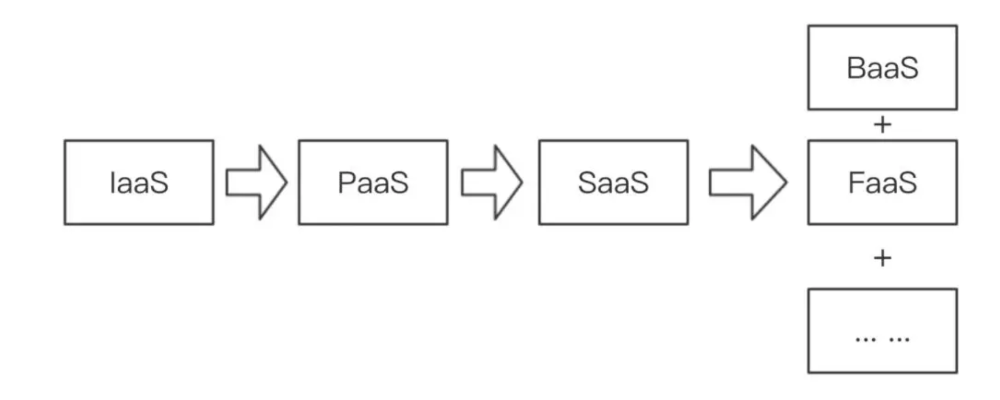

在短短十几年的发展过程中，云计算也从IaaS到PaaS，再到SaaS，逐渐的将去服务器化的趋势表现的愈发的明显。就目前的情况来看，全球各大IT企业，都在紧罗密布的部署自己的“云事业”，尤其是Serverless相关概念的推广和产品的推出以及项目的落地，包括AWS、Google Cloud、Azure、阿里云、腾讯云、华为云等在内的云厂商，无一例外的向Serverless进军。或许云计算下一个阶段，可能就是BaaS+FaaS+Others，即Serverless，当然也可能这个阶段就是！


## 什么是Serverless

Serverless可以说是一种架构，一种云计算发展的产物，至于具体说什么是Serverless，可能没有谁能给他一个明确的概念，如果非要说要这样一个可以稍微受众一些的概念，那或许可以参考Martin Fowler在《Serverless Architectures》中对Serverless这样定义：Serverless was first used to describe applications that significantly or fully incorporate third-party, cloud-hosted applications and services, to manage server-side logic and state. These are typically “rich client” applications—think single-page web apps, or mobile apps—that use the vast ecosystem of cloud-accessible databases (e.g., Parse, Firebase), authentication services(e.g., Auth0, AWS Cognito), and so on. These types of services have been previously described as “(Mobile) Backend as a service", and I use "BaaS" as shorthand in the rest of this article. Serverless can also mean applications where server-side logic is still written by the application developer, but, unlike traditional architectures, it’s run in stateless compute containers that are event-triggered, ephemeral (may only last for one invocation), and fully managed by a third party. One way to think of this is “Functions as a Service” or "FaaS".(Note: The original source for this name—a tweet by @marak—isno longer publicly available.) AWS Lambda is one of the most popular implementations of a Functions-as-a-Service platform at present, but there are many others, too.

当然这个描述貌似很长，读起来可能也有点干涩难懂，但是大家可以简单的粗暴的把Serverless认为是BaaS + FaaS，如果用一张图来表示上面的描述，可以是：

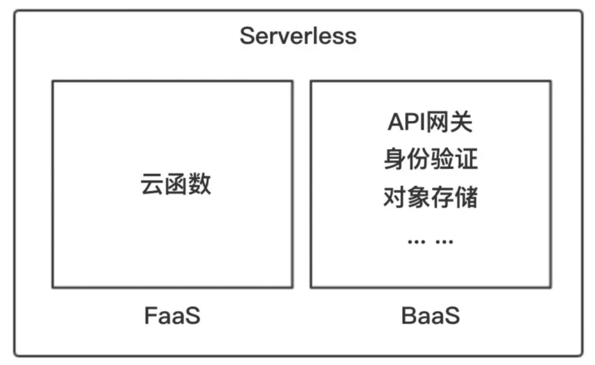

说到这里，可能不同的人已经对Serverless有了不同的勾勒，但是可能普遍还有一个疑问，我怎么用Serverless，他像云服务器上传我项目？还是像一种框架，我用他写代码？用了它我可以得到什么？性能的提升？效率的提高？成本的降低？

首先，我们以一个常见的Web服务为例：


在这个图中，服务器中可能涉及路由规则，鉴权逻辑以及其他各类复杂的业务代码，同时，开发团队要付出很大的精力在这个服务器的运维上面，包括客户量突然增多时是否需要扩容服务器；服务器上的脚本，业务代码等是否还在健康运行；是否有黑客在不断地对服务器发起攻击；也就是说，在这个图中，当我们把这个思路切换到Serverless的逻辑之后，变成了这样：

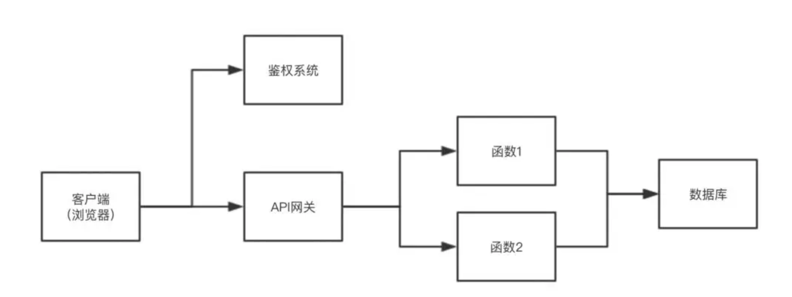

可以认为，当客户端和数据库未发生变的前提下，服务器变化巨大，之前需要开发团队维护的路由模块以及鉴权模块都将接入服务商提供的API网关系统以及鉴权系统，开发团队无须再维护这两部分的业务代码，只需要持续维护相关规则即可。同时业务代码也被拆分成了函数粒度，不同函数表示不同的功能。同时，在这个结构下，我们已经看不到服务器的存在，是因为Serverless的目的是让使用者只关注自己的业务逻辑即可，所以一部分安全问题，资源调度问题（例如用户量暴增、如何实现自动扩容等）全都交给云厂商负责，并且相对于传统项目而言，传统项目无论是否有用户访问，服务都在运行中，都是有成本支出，而Serverless而言，只有在用去发起请求时，函数才会被激活并且执行，并且会按量收费，相对来说可以在有流量的时候才有支持，没有流量的时候就没有支出，相对来说，成本会进一步降低。

通过这个分析和描述，不难看出，Serverless架构相对于传统的开发模式有什么区别，也逐渐的发现了它的优势，但是问题来了，很多工作都不需要我们做了，都交给云厂商做了，那么我们做做什么？

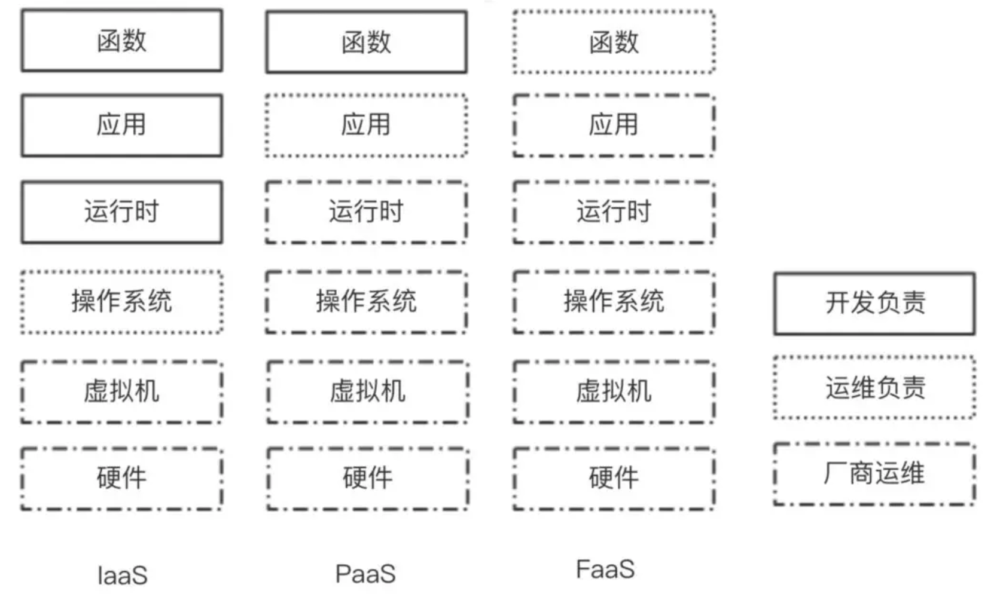

使用Serverless架构，用户不需要再自己维护服务器，也不需要自己操心服务器的各种性能指标和资源利用率，而是可以让用户付出更多的时间和精力去关心和关注应用程序本身的状态和逻辑。同时Serverless应用本身的部署十分容易，我们只要上传基本的代码，例如Python程序只需要上传其逻辑与依赖包，C/C++、Go等语言只需上传其二进制文件，Java只需要上传其Jar包等即可，同时不需使用Puppet、Chef、Ansible或Docker来进行配置管理，大大降低了运维成本。对于运维来说，Serverless架构也不再需要监控底层的数据，例如不再需要监控磁盘使用量、CPU使用率等，可以更加专注的将监控目光放到监控应用程序本身的度量。同时在Serverless架构上，运维人员的工作角色会有所转变，部署将变得更加自动化，监控将更加面向应用程序本身。

总而言之，Serverless是在传统容器技术和服务网格上发展起来，他更多指的是后端服务与函数服务的结合，对于开发者而言，而是让开发者将更多的经理关注在函数服务商，更侧重让使用者只关注自己的业务逻辑即可。它是云计算发展到一定阶段的必然产物，云计算作为普惠科技，发展到最后一定是绿色科技（最大程度利用资源，减少空闲资源浪费），大众科技（成本低，包括学习成本及使用成本）的产品，而Serverless将很好的诠释这些！Serverless架构被称为是“真正实现了当初云计算的目标”，这种说法虽然有些夸张，但是也从另一方面表现出了大家对Serverless架构的期盼和信心，自2012年被提出至今，Serverless架构也是经历了7年时间，正在逐渐的走向成熟。


## 入门Serverless

说起Serverless，就不得不说BaaS和FaaS，因为BaaS服务更多是云厂商给我们提供/维护，所以我们开发者精力额更多会在FaaS层面，或者说是在函数计算层面。

接下来，我们来体验一下Serverless，以腾讯云为例，我们通过腾讯云控制台，选择Serverless分类下的云函数：

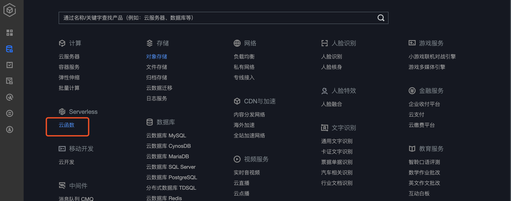

接下来就可以看到Serverless中的一部分：函数计算部分。此时，我们可以新建一个函数，进行基本的测试，体验一下Serverless下的Hello World和我们传统的Hello World有什么不同。

* 新建函数：

* 选择运行时（就是我们要用的编程语言）：
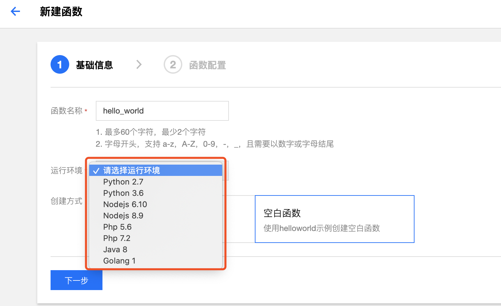
* 进行代码的编写：
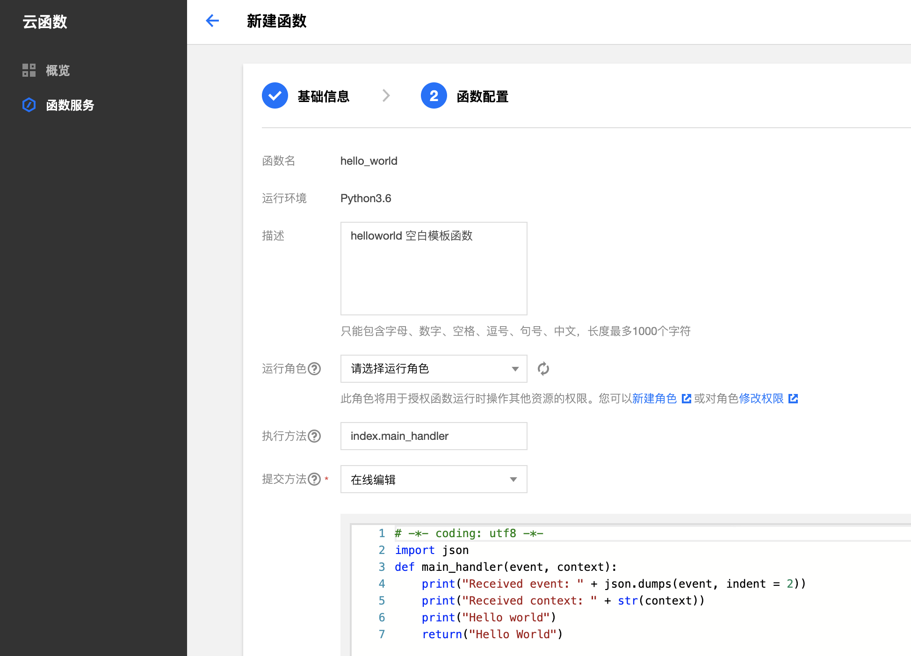
* 点击完成，即可保存代码
* 进行代码测试：
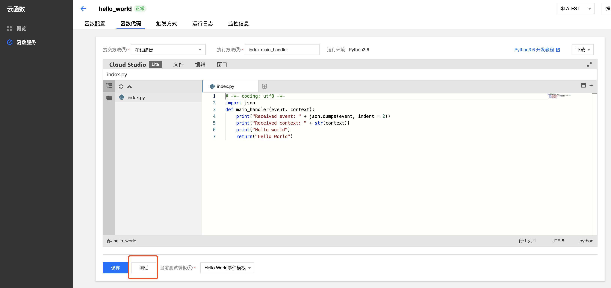
* 可以看到测试结果：
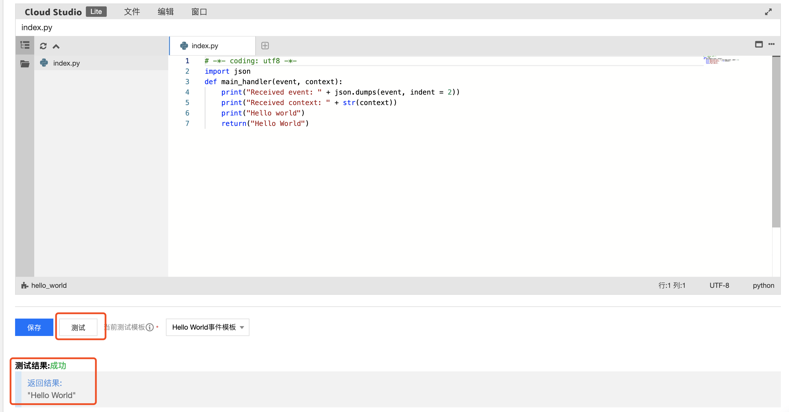

至此，我们完成了一个函数的基本编写，但是仔细想一下：貌似也没什么，感觉就是和一些在线编程工具差不多，可以在线编写代码，运行。BaaS体现在了哪里？体现在了给我们提供了运行环境？除了写了一个hello world，我还能干什么？

接下来，我们进行触发器的体验，所谓的触发器，就是说，我们的函数一般情况下都是"休息"的，他们并不工作，只有在一个"东西触碰它"，"激活它"，他才会起来干活，而这个东西就是触发器。刚刚我们是怎么让函数"起来工作的"？是通过屏幕上的"测试按钮"，所以说这也算是一个触发器。那么除了这个触发器，还有那些？

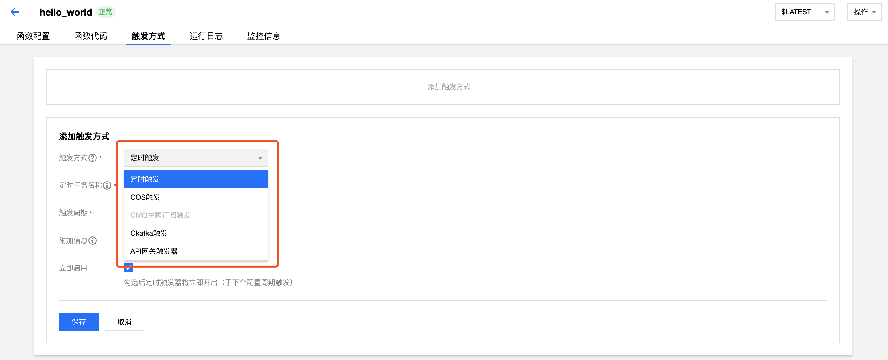

可以看到，目前腾讯云提供给我们的触发器包括：

* **定时触发器**（顾名思义，就是定好时间进行函数的触发，例如说每天几点触发一次，或者说每隔多久触发一次，这类操作适合我们做定时任务，例如我们定是进行数据采集/数据聚合，消息推送等。我用这个定时触发器和企业微信做结合，做了一个提醒吃饭喝水的小机器人，我还用这个触发器做了一个小脚本，监控我的后台服务是否健康运行。）
* **COS触发器** 我们可能会将文件存储到文件系统，在传统的云主机中，我们可以存到机器本身，但是Serverless架构下，由于函数是无状态的，所以我们不能作文减持久化，那么就需要一个外部的媒体，"对象存储"就是我们常用的持久化文件的产品，我们可以将一些文件存储在上面，例如图片，文档，可执行程序......，同时也可以通过存入到这个上面一个文件，来触发我们的函数。例如当有图片上传到对象存储中，函数计算会下载这个图片，进行图片压缩和水印等处理。
* **CMQ主题订阅触发器** CMQ主题订阅就是说，当我们CMQ中有队列存在，就可以将内容发给云函数，云函数来进行消费处理。
* **Ckafka触发** 与上面说的CMQ主题订阅触发器基本一样，只不过这个是Ckafka。当Ckafka中消息出现（可以是每条触发也可以是最多多少条触发），会让函数"起来工作"，进行数据处理，完成消费。
* **API网关触发器** 这个应该说是和函数关系非常紧密的一个服务。通过API网关触发，可以让我们的函数具被备访问能力。什么叫做被访问呢？就是说可以通过浏览器/接口直接使用，所以API网关触发器和云函数结合通常可以作网站，后台服务等。

此时，我们可以建立一个API网关触发器，看一函数和API网关结合所带来的有趣碰撞：

### 初探API网关与函数

我们新建一个API网关服务：

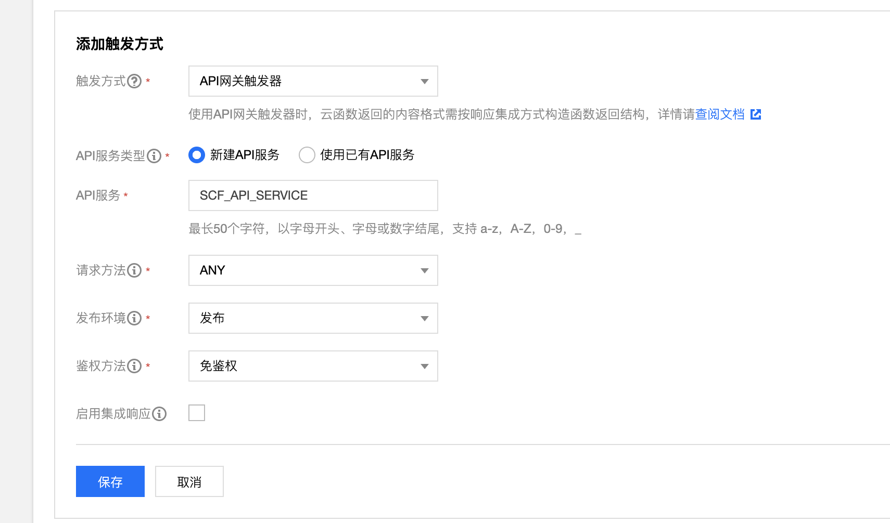

创建完成，系统会哥诶我们分配一个地址：

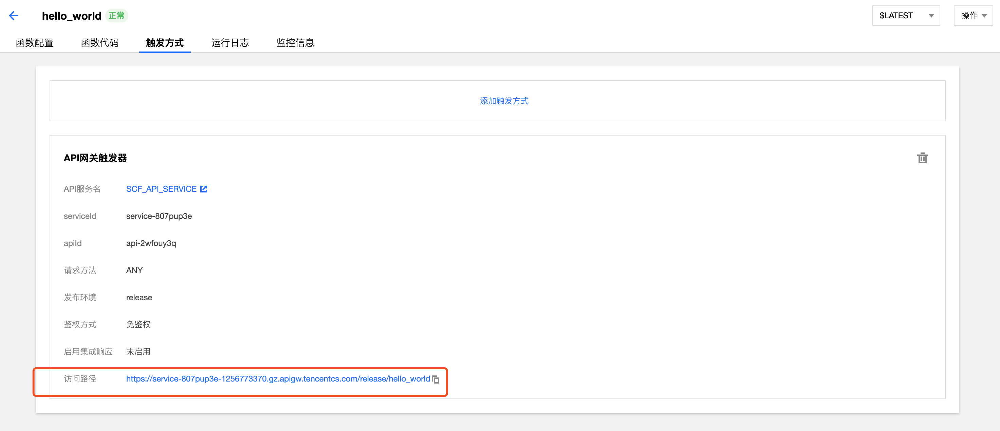

通过浏览器打开这个地址：


我们可以看到，我们成功的搭建了一个Web的服务，后台想我们展示了一个`Hello World`，如果是传统开发条件下，我们要做一个这样的页面，要做哪些工作？

* 使用框架开发一个`Hello World`
* 购买服务器，并配置服务器的环境
* 将本地开发好的项目上传到服务器中
* 购买域名/使用服务器IP，绑定我们的项目

这个过程可能涉及到的有常用的Web框架（例如Django，Spring，Express......），涉及到了服务器的软件（Nginx，Apache，Tomcat......），涉及到很多很多东西，甚至我们还要考虑，网站的流量有多大，我们买多大内存的机器，我们启动多少进程，多少线程，还要想办法对服务器进行各种优化，而我们刚才的操作：

* 建立函数
* 增加API网关触发器

其余的一切操作都不用我们关心，我们真真切切将更多的精力放在了"Coding"。

### 用函数和API网关做做点有趣的

我们在生产生活中，经常需要获取IP地址进行某些工作，例如我之前做了一个网站，这个网站的用户签名体系包括了用户的IP，而客户端想获得到用户IP是一个比较复杂的过程，一般情况下都会通过访问服务端的获取IP接口来获得客户端对应的IP地址。那么我们是否可以通过函数计算和API网关的到这个结果呢？

刚才说到了触发器，每种触发器都会和函数有一个规约，我给你一种什么样的格式数据，通过函数下面的测试模板可以看到：

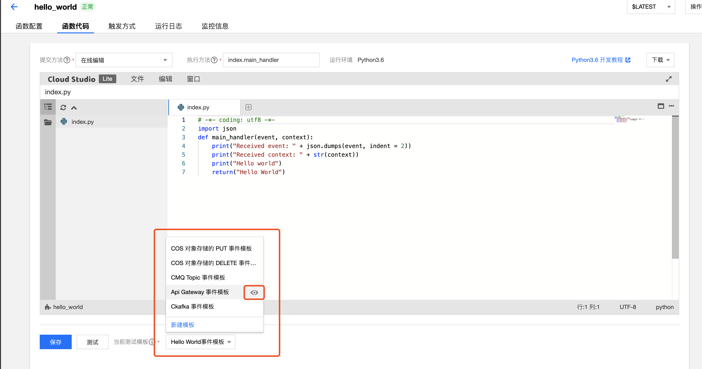

通过这里，可以看到API网关和函数约定的一个结构：

```json
{
  "requestContext": {
    "serviceId": "service-f94sy04v",
    "path": "/test/{path}",
    "httpMethod": "POST",
    "requestId": "c6af9ac6-7b61-11e6-9a41-93e8deadbeef",
    "identity": {
      "secretId": "abdcdxxxxxxxsdfs"
    },
    "sourceIp": "10.0.2.14",
    "stage": "release"
  },
  "headers": {
    "Accept-Language": "en-US,en,cn",
    "Accept": "text/html,application/xml,application/json",
    "Host": "service-3ei3tii4-251000691.ap-guangzhou.apigateway.myqloud.com",
    "User-Agent": "User Agent String"
  },
  "body": "{\"test\":\"body\"}",
  "pathParameters": {
    "path": "value"
  },
  "queryStringParameters": {
    "foo": "bar"
  },
  "headerParameters":{
    "Refer": "10.0.2.14"
  },
  "stageVariables": {
    "stage": "release"
  },
  "path": "/test/value",
  "queryString": {
    "foo" : "bar",
    "bob" : "alice"
  },
  "httpMethod": "POST"
}
```

同时，函数会将这个结构，作为入参之一传递给开发人员，例如腾讯云将这个参数命名为`event`，也就是说，开发者可以通过函数入口的`event`参数进行API网关相关内容的解析。

那么什么是函数的入口呢？

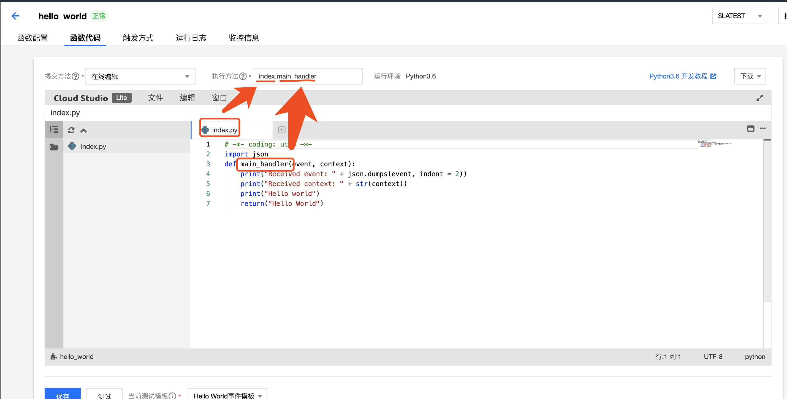

入口函数实际上就是用户代码中的文件名+方法名，这里面默认设定就是index文件中的main_handler方法，可以看到main_handler方法，确实有一个参数是event，这个参数就是触发器传递过来的数据结构。另外一个context参数是上下文，用户用户对上下文内容的处理，例如上游资源产生的RequestId，例如一些环境信息，密钥信息等。

我们通过上面的数据接口，可以看到，在requestContext中sourceIp，是用户的IP地址，那么我们是否就可以把这个IP直接返回给用户，实现IP查询功能呢？

```python
# -*- coding: utf8 -*-
import json
def main_handler(event, context):
    return({"ip": event['requestContext']['sourceIp']})
```

通过4行代码编写之后，我们绑定API网关，并且通过浏览器访问可以看到：


是的，这样一个功能，只需要4行代码就可以搞定。


## 再说说Serverless

刚刚我们已经入门了云函数，对云函数也有了一个初步的了解了，感觉到他很神奇，那么接下来，我们说说Serverless架构有哪些优点和缺点：

### 优点

* 弹性伸缩

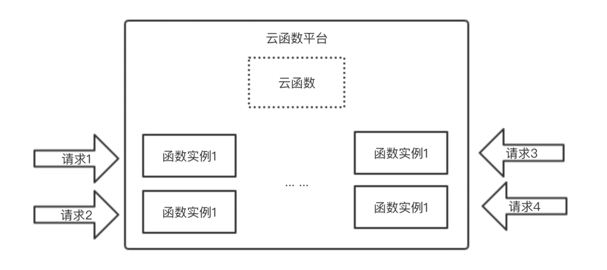

传统意义上，我们的一台服务器能接受多大的流量，峰值是多少，是需要我们进行评估的，同时也要后期不断维护和更新数据的，但是在Serverless架构下，这个问题不需要用户去考虑，云厂商将会为用户实现弹性伸缩的能力。当平台接收到第一个触发函数的事件时，它将启动一个容器来运行你的代码。如果此时收到了新的事件，而第一个容器仍在处理上一个事件，平台将启动第二个代码实例来处理第二个事件。SCF的这种自动的零管理水平缩放，将持续到有足够的代码实例来处理所有的工作负载。当并发出现的时候，实际上云厂商会启动多个容器来应对"流量洪峰"，相对于传统服务器来说，在这一层面上，Serverless架构或者说云函数真的是很方便了。

* 按量付费

按量付费是Serverless架构的一个优点，传统服务器，我们无论是否有流量，我们都要进行成本支出，并且我们的服务器配置还要按照某个时间段最大流量来进行配置，所以支出情况实际上是不合理的。但是函数计算实际上是按量收费，而且相对来说价格很低，尤其对不同时间段资源消耗峰值低谷有较大差距的项目而言，是真的很棒。

### 缺点

* 冷启动


说到Serverless架构的缺点就不得不说冷启动问题，冷启动无论是AWS还是Google还是腾讯云，阿里云，都是普遍存在的。一般情况下来说，冷启动就是函数在"睡觉"，突然有一个触发"他睁眼睛"的过程，实际上就是后台拉起容器、下载代码、启动进程、触发入口方法的一个过程，所以一般情况下，容器在首次启动的时候都会有冷启动，通过上图可以看到，函数冷启动可能达到击败毫秒甚至数秒，这对一些业务可能是致命打击，当然各个云厂商也在努力通过各种策略、方案降低冷启动率。

* 调试困难

云函数的另一个缺点是调试困难，由于它提供给我们的是一个函数运行的容器，而且很多基本业务又是和厂商绑定的，这就导致我们调试困难。例如，我们要调试一个函数，简单来说可以通过本来来模拟一些触发器情况进行调试，但是，如果函数中涉及到了一些内网资源，例如与redis相关，只能通过vpc访问的资源，那么这个时候进行本地调试困难度就会成倍增加，在线调试又可能因为日志输出过慢，导致调试整体体验极差。

## 总结

云计算的发展，Serverless是一个必然的产物。Serverless作为一个新技术或者说是一个新家的架构，很难通过一篇文章进行描述清楚，无论是他的优点还是缺点也都不仅仅是上文所描述的那两个，只是挑了比较典型的说说而已，Serverless在使用的时候也会有很多坑，有的时候真的是从入门到放弃，有的时候也会觉得他真的很方便，又从放弃到入坑，但是无论怎么说，作为一个相对来说比较新鲜的事物，Serverless有更多的领域，价值等待我们去开发和探索，包括Serverless的应用领域，使用经验等。


Serverless架构被称为是“真正实现了当初云计算的目标”，这种说法虽然有些夸张，但是也从另一方面表现出了大家对Serverless架构的期盼和信心，自2012年被提出至今，Serverless架构也是经历了7年时间，正在逐渐的走向成熟。随着容器技术，IoT，5G，区块链等技术的快速发展， 技术上对去中心化，轻量虚拟化，细粒度计算等技术需求愈发强烈，而Serverless必将借势迅速发展，未来Serverless将在云计算的舞台上大放异彩！