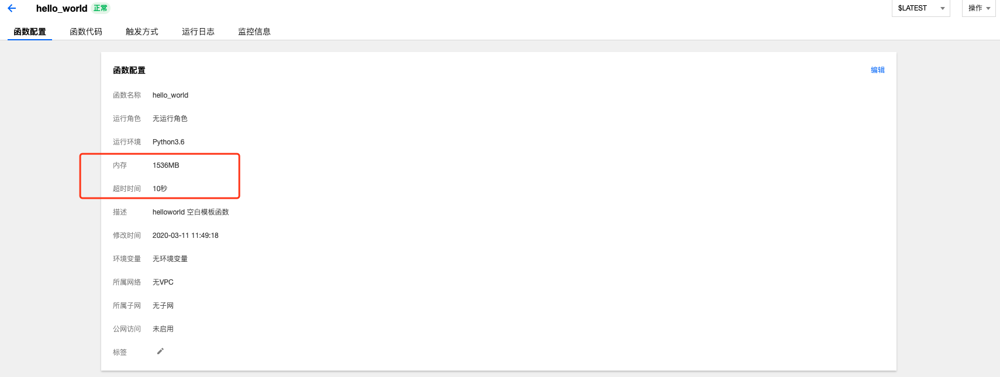
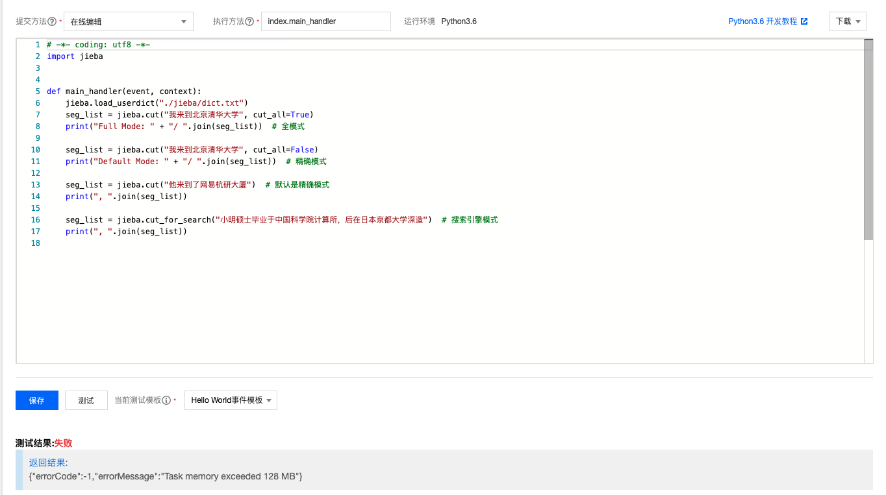
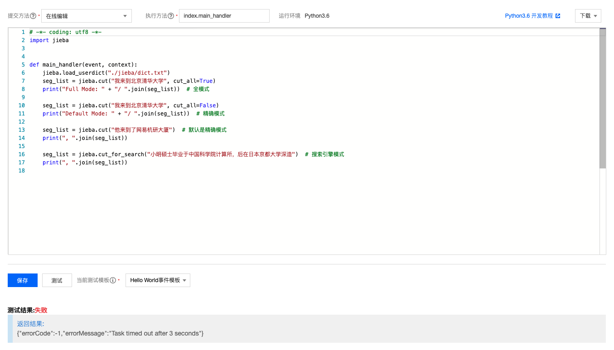
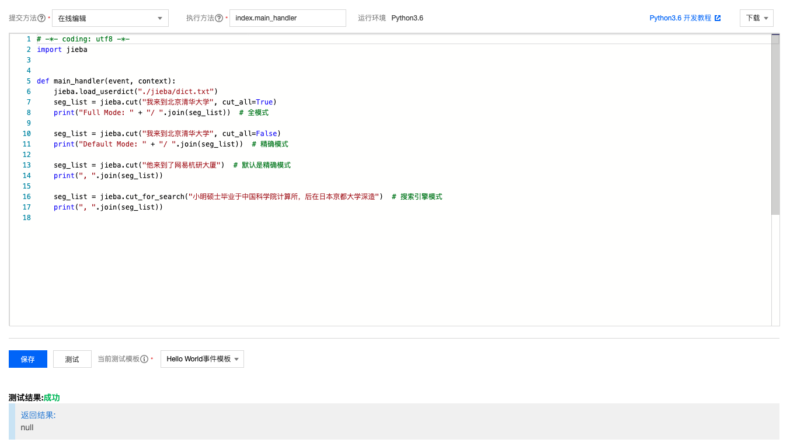
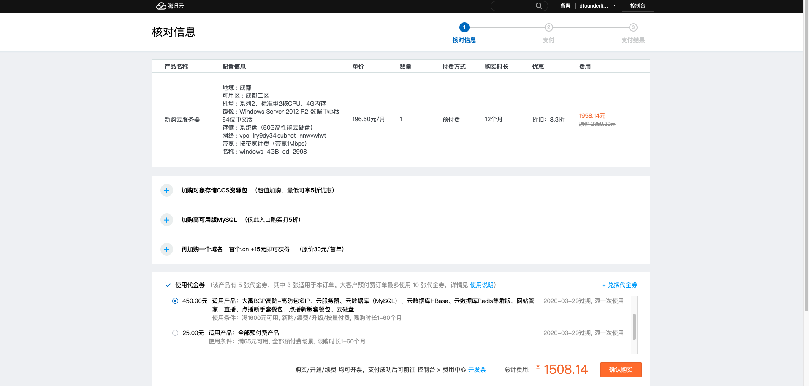
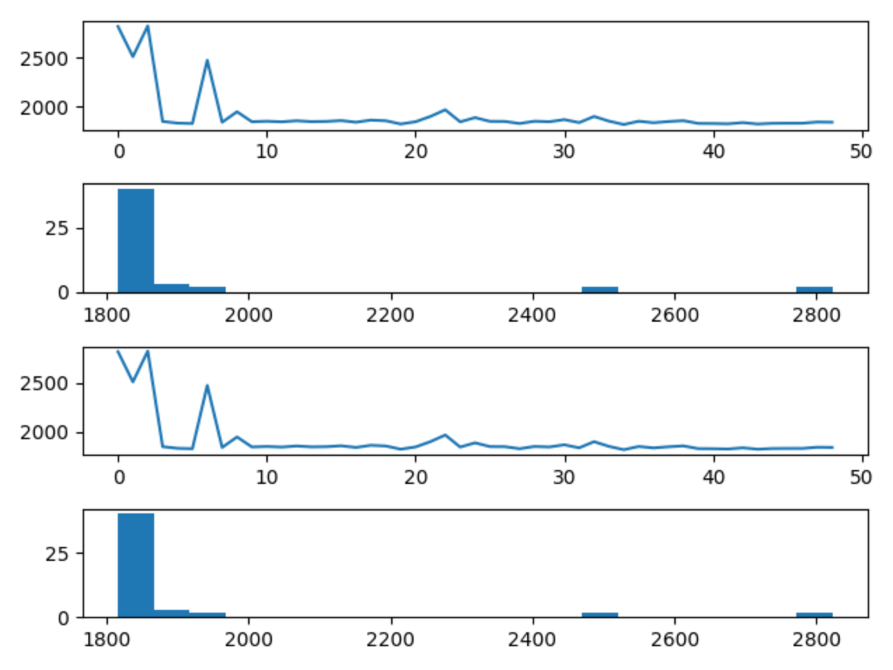
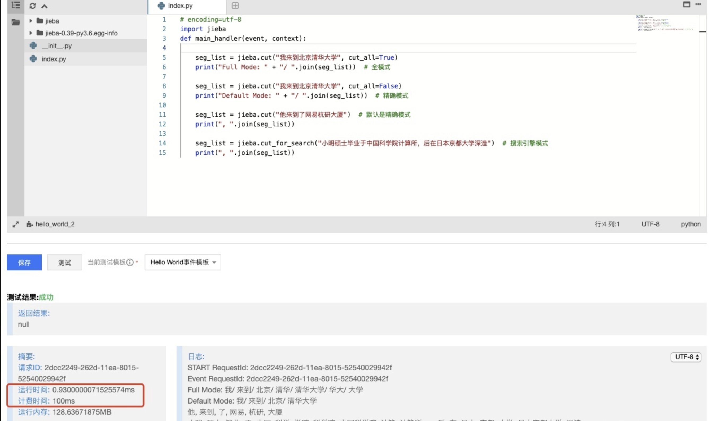
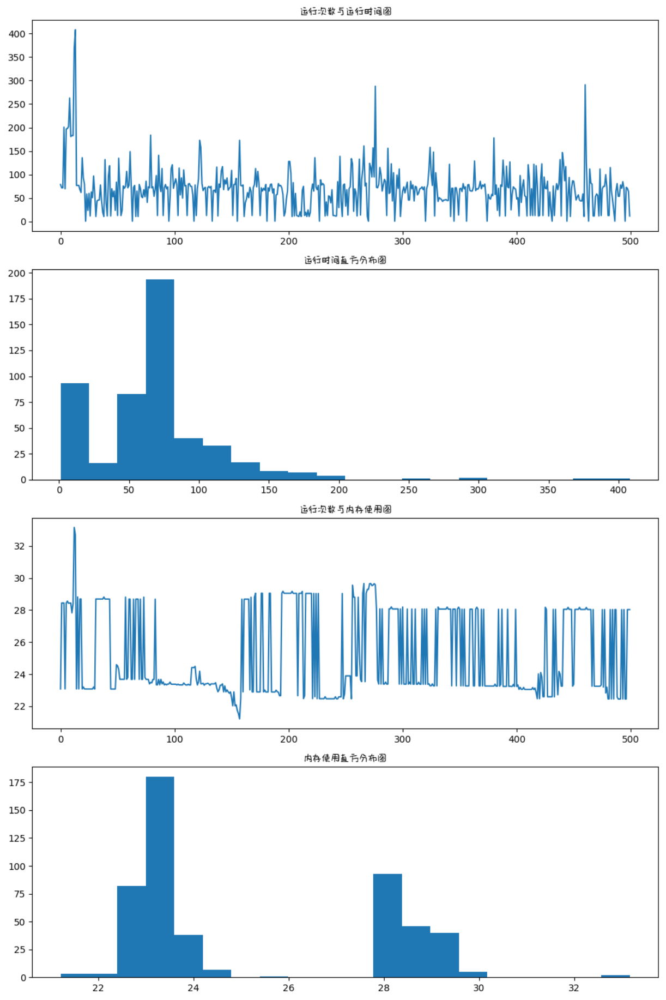

# 第六篇： Serverless架构下的函数资源评估的意义

## 前言

在很多的场合中，Serverless的布道师常常说Serverless架构和云主机等区别的时候，都会有类似的描述：

> 传统业务开发完成想要上线，需要评估资源使用，根据资源评估结果，购买云主机，并且需要根据业务发展不断对主机等资源进行升级维护，而Serverless架构，则不需要这样复杂的流程，只需要将函数部署到线上，一切后端服务交给运营商来处理，哪怕是瞬时高并发，也有云厂商为您自动扩缩。

但是，在实际生产生活中，Serverless真的是这样无需对资源评估么？还是说在Serverless架构下，资源评估的内容或者对象发生了变化，或者说进行了简化呢？

## 探索Serverless下的资源评估

以国内某云厂商为例，在其云函数中，我们创建一个云函数之后，可以看到在设置页面有几个设置项是可以进行设置的：



这两个设置范围分别是从64M到1536M，和1-900S，涉及到这样的配置，我觉得就是涉及到了资源评估。

首先先说超时时间，我们一个项目或者说一个函数，一个Action都是有执行时间的，如果超过某个时间没执行完就可以评估其为发生了“意外”，可以被“干掉“了，这个就是超时时间，例如我们有一个简单请求，是获取用户信息的请求，我们预估，如果10S中没有返回证明已经不满足业务需求，所以这个时候就可以将超时设置为10S，如果说我们有一个业务，运行速度比较慢，至少要50S才能执行完，那么这个值设置的时候就要大于50，否则程序可能因为超时被强行停止。

然后再说说内存，内存是一个有趣的东西，可能衍生两个关联点。

关联点1: 程序本身需要一定的内存，这个内存要大于程序本身的内存，以Python语言为例：

```python
# -*- coding: utf8 -*-
import jieba


def main_handler(event, context):
    jieba.load_userdict("./jieba/dict.txt")
    seg_list = jieba.cut("我来到北京清华大学", cut_all=True)
    print("Full Mode: " + "/ ".join(seg_list))  # 全模式

    seg_list = jieba.cut("我来到北京清华大学", cut_all=False)
    print("Default Mode: " + "/ ".join(seg_list))  # 精确模式

    seg_list = jieba.cut("他来到了网易杭研大厦")  # 默认是精确模式
    print(", ".join(seg_list))

    seg_list = jieba.cut_for_search("小明硕士毕业于中国科学院计算所，后在日本京都大学深造")  # 搜索引擎模式
    print(", ".join(seg_list))

```

（对程序代码的说明，为了让结果更佳直观，差距更加大，所以在这里每次都重新导入了自带了dict，这个操作本身就是相对浪费时间和内存的。在实际使用中jieba自带缓存，并且无需手动导入本身的dict）

当我导入一个自定义的dict到jieba中，如果此时我函数内存设置的默认128M内存限制+3S超时限制就会这样：



此时可以看到，由于在导入自定义dict的时候，内存消耗过大， 默认的额128不足以满足需求，所以此时我将其修改成最大：



他又提醒我们时间超时，所以我们还需要再修改超时时间为适当的数值（此处设定为10S）：



所以说，在关注程序本身的前提下，我们可以认为，我们要把内存设置到一个合理范围内，这个范围是>=程序本身需要的内存数值。

关联点2: 计费相关，在云函数的文档中，我们可以看到：

> 云函数 SCF 按照实际使用付费，采用后付费小时结，以 **元** 为单位进行结算。  
> SCF 账单由以下三部分组成，每部分根据自身统计结果和计算方式进行费用计算，结果以 **元** 为单位，并保留小数点后两位。  
> 资源使用费用  
> 调用次数费用  
> 外网出流量费用

调用次数和出网流量这部分，都是我们程序或者使用本身相关了，而资源使用费用这则有一些注意点：

>  **资源使用量 = 函数配置内存 × 运行时长**  
>  用户资源使用量，由函数配置内存，乘以函数运行时的计费时长得出。其中配置内存转换为 GB
> 单位，计费时长由毫秒（ms）转换为秒（s）单位，因此，资源使用量的计算单位为 **GBs** （GB-秒）。  
> 例如，配置为256MB的函数，单次运行了 1760 ms，计费时长为 1760
> ms，则单次运行的资源使用量为（256/1024）×（1760/1000） = 0.44 GBs。  
> 针对函数的每次运行，均会计算资源使用量，并按小时汇总求和，作为该小时的资源使用量。

这里有一个非常重要的公式，那就是函数配置内存*运行时长。

函数配置内存就是我们刚才说的，我们为程序选择的内存大小，运行时长，就是我们运行程序之后得到的结果：


以我这个程序为例，我用的是1536MB，则使用量为(1536/1024) * (3200/1000) = 4.8GBs

当然，我此时如果是250MB的话，程序也可以运行：


此时的资源使用量为(256/1024) * (3400/1000) = 0.85GBs

相对比上一次，程序执行时间增加了0.2S，但是资源使用量降低了将近6倍！

产品单价是：


虽然说GBs的单价很低很低，但是当我们业务量上来之后，这个数字也是要值得注意的，因为我刚才的只是一个单次请求，如果每天有1000此次请求，那：

（仅计算资源使用量费用，而不计算调用次数/外网流量）

1536MB： 4.8*1000*0.00011108 = 0.5元

256MB：0.85*1000*0.00011108 = 0.09442元

如果不是1000次调用，而是10万次调用，则就是50元和9元的区别，差距很大，随着流量越大，差距越大。

当然很多时候函数执行时间不会这么久，以我个人的某个函数为例：


计费时间均是100ms，每日调用量在6000次左右：


如果按照64M内存来看，单资源费用只要76元一年，而如果内存都设置称为1536，则一年要1824元！这个费用相当于：



所以说，超时时间，是需要对代码和业务场景进行评估来进行设置，他可能关系到程序运行的稳定和功能的完整性；内存，则不仅仅在程序使用层面有着不同的需求，在费用成本等方面也占有极大的比重，所以内存设置还是需要对程序进行一个评估，那么评估问题来了，我设置多大比较划算呢？同样是之前的代码，在本地进行简单的脚本编写：

```python
from tencentcloud.common import credential
from tencentcloud.common.profile.client_profile import ClientProfile
from tencentcloud.common.profile.http_profile import HttpProfile
from tencentcloud.common.exception.tencent_cloud_sdk_exception import TencentCloudSDKException
from tencentcloud.scf.v20180416 import scf_client, models

import json
import numpy
import matplotlib.pyplot as plt

try:
    cred = credential.Credential("", "")
    httpProfile = HttpProfile()
    httpProfile.endpoint = "scf.tencentcloudapi.com"

    clientProfile = ClientProfile()
    clientProfile.httpProfile = httpProfile
    client = scf_client.ScfClient(cred, "ap-shanghai", clientProfile)

    req = models.InvokeRequest()
    params = '{"FunctionName":"hello_world_2"}'
    req.from_json_string(params)

    billTimeList = []
    timeList = []
    for i in range(1, 50):
        print("times: ", i)
        resp = json.loads(client.Invoke(req).to_json_string())
        billTimeList.append(resp['Result']['BillDuration'])
        timeList.append(resp['Result']['Duration'])

    print("计费最大时间", int(max(billTimeList)))
    print("计费最小时间", int(min(billTimeList)))
    print("计费平均时间", int(numpy.mean(billTimeList)))

    print("运行最大时间", int(max(timeList)))
    print("运行最小时间", int(min(timeList)))
    print("运行平均时间", int(numpy.mean(timeList)))

    plt.figure()
    plt.subplot(4, 1, 1)
    x_data = range(0, len(billTimeList))
    plt.plot(x_data, billTimeList)
    plt.subplot(4, 1, 2)
    plt.hist(billTimeList, bins=20)
    plt.subplot(4, 1, 3)
    x_data = range(0, len(timeList))
    plt.plot(x_data, timeList)
    plt.subplot(4, 1, 4)
    plt.hist(timeList, bins=20)
    plt.show()

except TencentCloudSDKException as err:
    print(err)
```    
   
运行之后会为我们输出一个简单的图像：



从上到下分别是不同次数计费时间图，计费时间分布图，以及不同次数运行时间图和运行时间分布图。通过对256M起步，1536M终止，步长128M，每个内存大小串行靠用50次，统计表：


注：为了让统计结果更加清晰，差异性比较大，比较明显，在程序代码中进行了部分无用操作用来增加程序执行时间。正常使用jieba的速度基本都是毫秒级的：



通过表统计可以看到在满足程序内存消耗的前提下，内存大小对程序执行时间的影响并不是很大，反而是对计费影响很大。

当然上面是两个重要指标，一个是超时时间另一个是运行内存，除了这两者，还有一个参数需要用户来评估：函数并发量，在项目上线之后，还要对项目可能产生的并发量进行评估，当评估的并发量超过默认的并发量，要及时联系售后同学或者提交工单进行最大并发量数值的提升。

> 除了上面的简单侧睡，有兴趣的同学也可以进行多进程/多线程与函数执行时间/内存关系的评估，但是考虑到很多时候云函数的业务都不涉及到多进程/多线程，所以这里不仅行单独测试。

## 应该如何设置函数的内存与超时时间


上一部分主要说了Serverless架构与资源评估：性能与成本探索​

是关于性能和成本的探索，探索之后，就不得不引出一个新的问题：我们在使用Serverless架构的时候，要如何来设置自己的运行内存和超时时间呢？

其实评估的方法有很多，但是今天我想分享一下我的评估方法。

首先，我会将我的函数上线，选择一个稍微大一点的内存，例如，我将我的函数执行一次：


得到这样的结果，我就将我的函数设置为128M或者256M，超时时间设置成3S。

然后我让我的函数跑一段时间，例如我这个接口每天触发次数大约为4000+次：


我就将这个函数的日志捞出来，写成一脚本，做统计：

```python
import json, time, numpy, base64
import matplotlib.pyplot as plt
from matplotlib import font_manager
from tencentcloud.common import credential
from tencentcloud.common.profile.client_profile import ClientProfile
from tencentcloud.common.profile.http_profile import HttpProfile
from tencentcloud.common.exception.tencent_cloud_sdk_exception import TencentCloudSDKException
from tencentcloud.scf.v20180416 import scf_client, models

secretId = ""
secretKey = ""
region = "ap-guangzhou"
namespace = "default"
functionName = "course"

font = font_manager.FontProperties(fname="./01.ttf")

try:
    cred = credential.Credential(secretId, secretKey)
    httpProfile = HttpProfile()
    httpProfile.endpoint = "scf.tencentcloudapi.com"

    clientProfile = ClientProfile()
    clientProfile.httpProfile = httpProfile
    client = scf_client.ScfClient(cred, region, clientProfile)

    req = models.GetFunctionLogsRequest()

    strTimeNow = time.strftime("%Y-%m-%d %H:%M:%S", time.localtime(int(time.time())))
    strTimeLast = time.strftime("%Y-%m-%d %H:%M:%S", time.localtime(int(time.time()) - 86400))
    params = {
        "FunctionName": functionName,
        "Limit": 500,
        "StartTime": strTimeLast,
        "EndTime": strTimeNow,
        "Namespace": namespace
    }
    req.from_json_string(json.dumps(params))

    resp = client.GetFunctionLogs(req)

    durationList = []
    memUsageList = []

    for eveItem in json.loads(resp.to_json_string())["Data"]:
        durationList.append(eveItem['Duration'])
        memUsageList.append(eveItem['MemUsage'] / 1024 / 1024)

    durationDict = {
        "min": min(durationList),  # 运行最小时间
        "max": max(durationList),  # 运行最大时间
        "mean": numpy.mean(durationList)  # 运行平均时间
    }
    memUsageDict = {
        "min": min(memUsageList),  # 内存最小使用
        "max": max(memUsageList),  # 内存最大使用
        "mean": numpy.mean(memUsageList)  # 内存平均使用
    }

    plt.figure(figsize=(10, 15))
    plt.subplot(4, 1, 1)
    plt.title('运行次数与运行时间图', fontproperties=font)
    x_data = range(0, len(durationList))
    plt.plot(x_data, durationList)
    plt.subplot(4, 1, 2)
    plt.title('运行时间直方分布图', fontproperties=font)
    plt.hist(durationList, bins=20)
    plt.subplot(4, 1, 3)
    plt.title('运行次数与内存使用图', fontproperties=font)
    x_data = range(0, len(memUsageList))
    plt.plot(x_data, memUsageList)
    plt.subplot(4, 1, 4)
    plt.title('内存使用直方分布图', fontproperties=font)
    plt.hist(memUsageList, bins=20)

    # with open("/tmp/result.png", "rb") as f:
    #     base64_data = base64.b64encode(f.read())

    print("-" * 10 + "运行时间相关数据" + "-" * 10)
    print("运行最小时间:\t", durationDict["min"], "ms")
    print("运行最大时间:\t", durationDict["max"], "ms")
    print("运行平均时间:\t", durationDict["mean"], "ms")

    print("\n")

    print("-" * 10 + "内存使用相关数据" + "-" * 10)
    print("内存最小使用:\t", memUsageDict["min"], "MB")
    print("内存最大使用:\t", memUsageDict["max"], "MB")
    print("内存平均使用:\t", memUsageDict["mean"], "MB")

    print("\n")

    plt.show(dpi=200)


except TencentCloudSDKException as err:
    print(err)
```    

运行结果：

```text
----------运行时间相关数据----------
运行最小时间:	 1 ms
运行最大时间:	 291 ms
运行平均时间:	 63.45 ms


----------内存使用相关数据----------
内存最小使用:	 21.20703125 MB
内存最大使用:	 29.66015625 MB
内存平均使用:	 24.8478125 MB
```



通过这样一个结果，可以清楚看出，近500次，每次函数的时间消耗和内存使用。

可以看到时间消耗，基本在1S以下，所以此处超时时间设置成1S基本就是合理的，而内存使用基本是64M以下，所以此时内存设置成64M就可以。当然，通过这个图，可以看出来，云函数在执行时，可能会有一定的波动，所以无论是内存使用还是超时时间，都可能会出现一定的波动，可以根据自身的业务需求来做一些舍弃，将我们的资源使用量压到最低，节约成本。


## 总结


综上所述，Serverless架构也是需要资源评估的，而且资源评估同样和成本是直接挂钩的，只不过这个资源评估的对象逐渐发生了变化，相对之前的评估唯独，难度而言，都是大幅度缩小或者降低的。在我们上线函数之前，是要进行资源的基本评估的，我的做法基本就是分为两步走：
  * 简单运行两次，评估一下基础资源使用量，然后设置一个稍微偏高的值；
  * 函数运行一段时间，得到一定的样本值，在进行数据可视化和基本的数据分析，得到一个相对稳定权威的数据；


